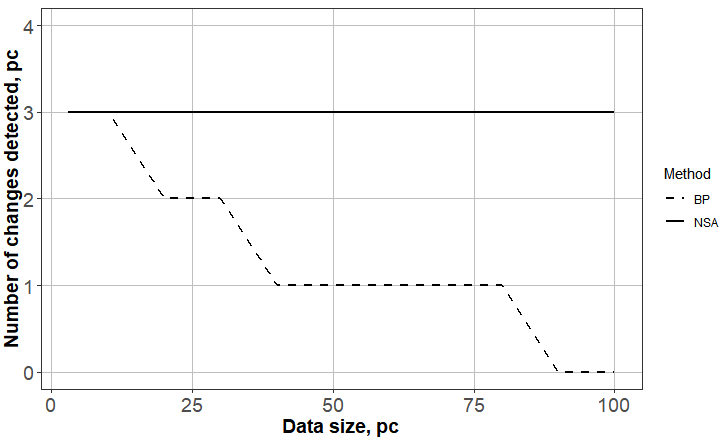
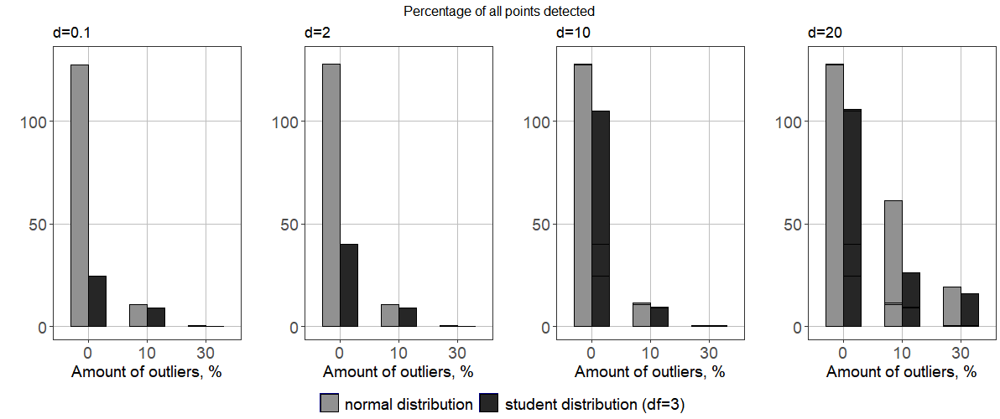

# RPlotsPatterns
This repository is designed to store some nice R scripts for producing different types of plots. 

## Two curves on one plot
In many problems, comparison of different curves is quite essential and we also faced this issue considerably often. This is why there appeared a need to store this type of a script separately. In the current case, we aim to compare the performance of two methods (abbreviated as BP and NSA) based on the number of changes they were able to detect in a set of datasets of different length.
we have a dataset (DataForTwoCurvesPlot.txt) containing three columns:
* DS - data size 
* BP - number of changes BP found in this dataset
* NSA - correspondingly, the number of changes NSA found in this dataset

This dataset was generated within my private research in educational purposes. To draw the plots we are using the library <b>ggplot2</b>. After driving the data to a required form we run the following code
```
ggplot(data=df4, aes(x=x, y=y)) +
  #draw line with different linetypes
  geom_line(size=1, aes(linetype=Method))+
  #axis titles
  xlab("Data size, pc") +
  ylab("Number of changes detected, pc") +
  #set limits for y axis
  ylim(0, 4) +
  #set line types manually (to redo the automatic selection of types)
  scale_linetype_manual(values=c("dashed","solid"))+
  theme_bw() +
  theme(
    #axis adjustment
    axis.title.x = element_text(face="bold",size=14),
    axis.title.y = element_text(face="bold",size=14),
    axis.text = element_text(size = 14),
    
    #legend adjustment
    legend.key = element_rect(fill = "white"),
    legend.background = element_rect(fill = "white"),
    
    #grid adjustment
    panel.grid.major = element_line(colour = "grey"),
    panel.grid.minor = element_blank()
  ) 
  ```
  which gives us the desired graph
  <p align="center">
  
</p>
One might easily adjust all the parts of the code to fit a custom problem. Although here we used only black-and-white theme and coloring, it is easy to make the graph look more bright with

```
geom_line(size=1, aes(color=Method))

```

## Multiple histograms on one plot

This problem also appeares in the scope of my personal scientific research. Briefly, the task is to compare the performance of one method by the percentage of change points it is able to detect under different settings. We vary the magnitude of a change <i>d</i> in each setup (<i>d</i>=0.10, <i>d</i>=2, <i>d</i>=10, <i>d</i>=20) and according to it, we aim to build four correspondings historgams. For each <i>d</i> we vary the number of outliers (0%,10%,30%) and the error distribution (normal and student). This means that for each <i>d</i> we have 6 numbers responsible for percentage rates (change detection rates) that we aim to compare. Basically, our goal is to build 4 histograms (divided by <i>d</i> parameter), each containing bars comparing normal vs. student distribution rates under different number of outliers. 

The dataset (DataForMultipleHistos.txt) contains some additional information regarding this problem, but we are interested only in the following columns:
* Magn - magnitude of a change (Small, Medium, Large, Huge)
* Outl - percent of outliers in a dataset
* All - percent of points detected under normal distribution
* All_s - percent of points detected under student distribution

As each histogram will look the same, we create the graphs in a loop to further put them all to a single plot. This dynamic approach requires to predefine some general variables about all the histograms we are aiming to create.
```
plots <- list()
#titles of four historgrams to plot
names <- c("d=0.1","d=2","d=10", "d=20")
ditributionNames <-c("normal distribution","student distribution (df=3)")
xlabTitle <- "Amount of outliers, %"

#make a common legend for several plots
#https://github.com/hadley/ggplot2/wiki/Share-a-legend-between-two-ggplot2-graphs
g_legend<-function(a.gplot){
  tmp <- ggplot_gtable(ggplot_build(a.gplot))
  leg <- which(sapply(tmp$grobs, function(x) x$name) == "guide-box")
  legend <- tmp$grobs[[leg]]
  return(legend)}
```
Then, everything is ready to loop through all 4 magnitudes:
```
for (i in 1:4)
{
  currentData <- data[((3*i)-2):((3-i)+1),]
  
  #relevant data retrieval part
  df2 = data.frame(y = currentData[,"All"], x = currentData[,"Outl"]*100)
  df3 = data.frame(y = currentData[,"All_s"], x = currentData[,"Outl"]*100)
  df2$id <- ditributionNames[1]
  df3$id <- ditributionNames[2]
  df4 <- rbind(df2,df3)
  df4 <- as.data.frame(lapply(df4, unlist))
  df4$id <- factor(df4$id)
  
  #create the plot itself
  currentPlot<- ggplot(data=df4, aes(x=factor(x), y=y, fill=id)) +
    #draw the bars
    geom_bar(width=.6,stat="identity", position=position_dodge(), colour="black") +
    #adjust labs data
    xlab(xlabTitle) +
    ylab("") +
    ylim(0, 130) +
    #set the title for the plot
    ggtitle(names[[i]])+
    #colors of bars
    scale_fill_manual(values=c("gray57", "gray15"), name ="")+
    theme_bw() +
    theme(
      #axis adjustment
      axis.title.x = element_text(size=14),
      axis.title.y = element_text(size=14),
      axis.text = element_text(size = 14),
      
      #legend adjustment
      legend.key = element_rect(fill = "navy"),
      legend.background = element_rect(fill = "white"),
      legend.position="bottom",
      legend.text = element_text(size = 14),
      
      #grid adjustment
      panel.grid.major = element_line(colour = "grey"),
      panel.grid.minor = element_blank()
    ) 
  
  plots[[i]] = currentPlot
}
```

Now we have a list <i>plots</i> containing all 4 histograms and we need to show them in a single plot. First, we need to get a single legend for them (we use g_legend function from https://github.com/hadley/ggplot2/wiki/Share-a-legend-between-two-ggplot2-graphs). Second, we do the plotting itself:

```
#build a legend
mylegend<-g_legend(plots[[1]])

#draw the final plot
finalPlot <- grid.arrange(top="Percentage of all points detected",
                   arrangeGrob(plots[[1]] + theme(legend.position="none"),
                               plots[[2]] + theme(legend.position="none"),
                               plots[[3]] + theme(legend.position="none"),
                               plots[[4]] + theme(legend.position="none"),
                               nrow=1),
                   mylegend, nrow=2,heights=c(10, 1))
```
And here is the desired result:

<p align="center">
  
</p>
